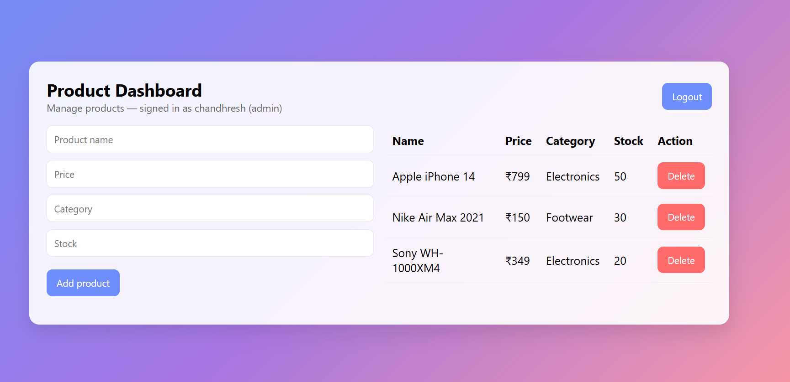
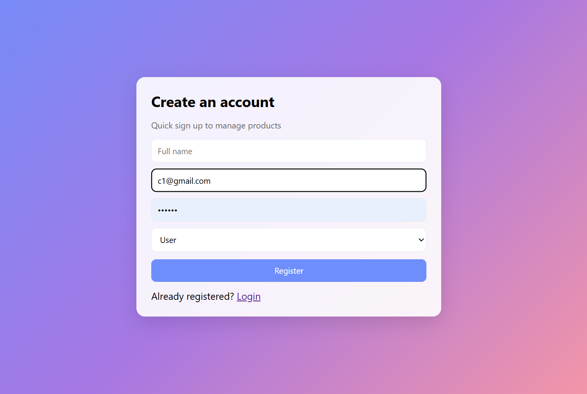
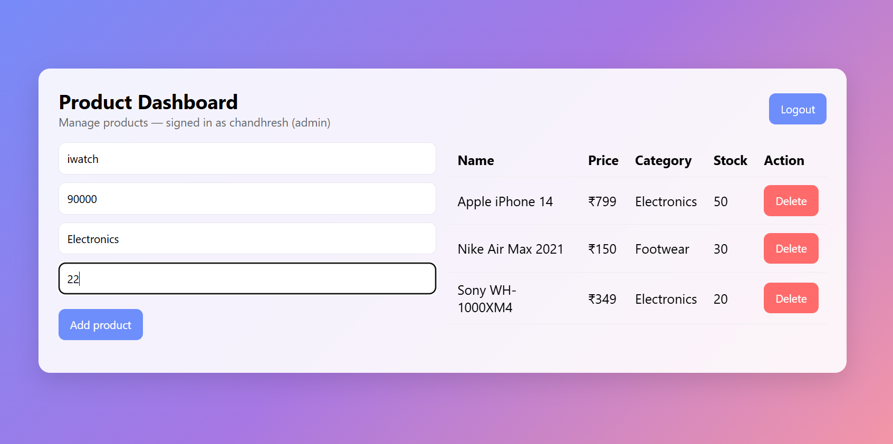
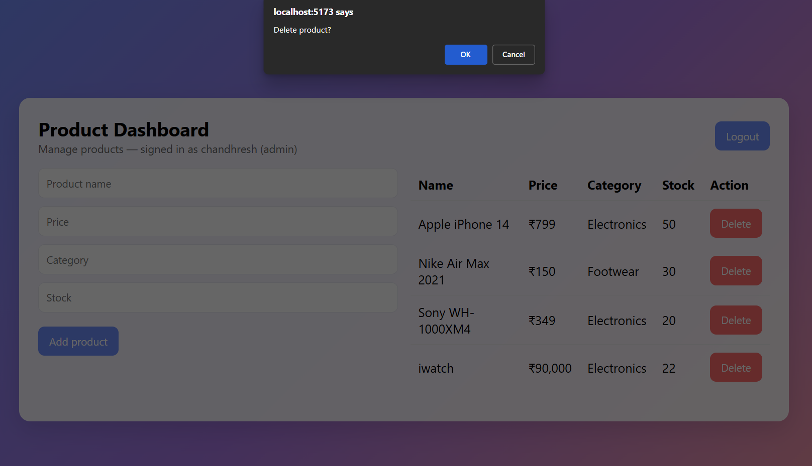
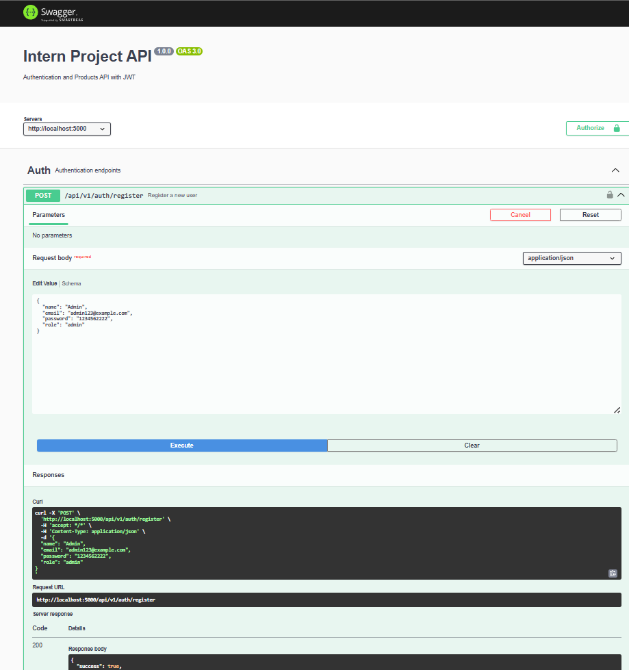
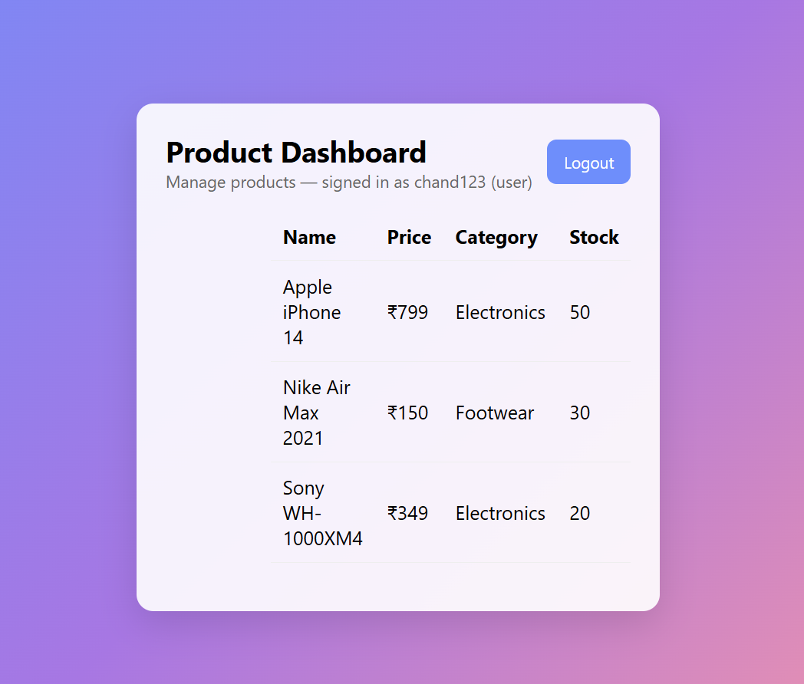
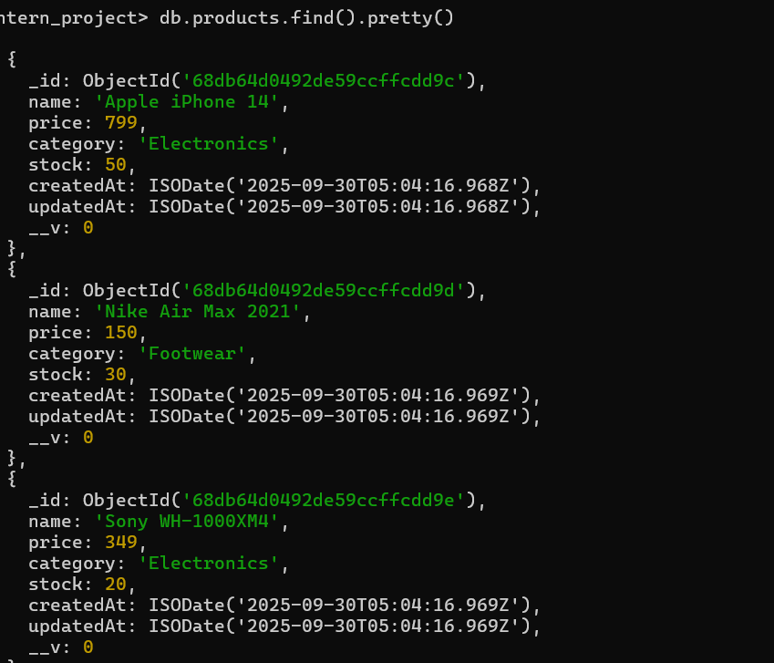
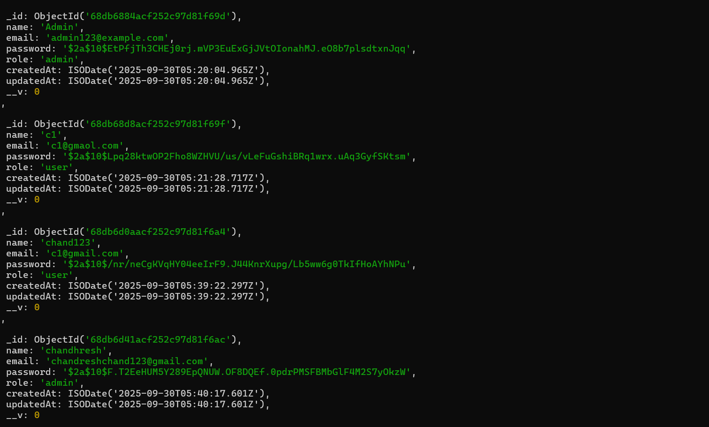

# Backend Developer (Intern) – Product Management Project

## Project Overview
This project demonstrates a **secure and scalable backend API** with **authentication, role-based access control**, and **CRUD operations for products**.  
A simple **React.js frontend** is included to interact with the API, register/login users, and manage products based on roles.

**Technologies Used:**
- Node.js, Express.js
- MongoDB, Mongoose
- JWT Authentication
- Swagger API Documentation
- React.js frontend (Vite)
- dotenv, axios, cors, morgan

---

## Project Structure

```

backend/
│
├─ server.js                  # Main server with Swagger integration
├─ .env                       # Environment variables (MongoDB URI, JWT secret)
├─ package.json               # Dependencies & scripts
│
├─ src/
│  ├─ controllers/
│  │   ├─ authController.js    # User register & login logic
│  │   └─ productController.js # CRUD for products
│  │
│  ├─ routes/
│  │   ├─ auth.js              # Authentication routes with Swagger
│  │   └─ products.js          # Products routes with Swagger
│  │
│  ├─ utils/
│  │   ├─ authMiddleware.js    # JWT authentication & role-based access
│  │   └─ seedDemo.js          # Seed default admin + demo products
│  │
│  └─ models/
│      ├─ User.js              # User schema
│      └─ Product.js           # Product schema

frontend/
│
├─ src/
│  ├─ components/              # React components
│  ├─ App.jsx                   # Main frontend App
│  └─ index.jsx
│
├─ screenshots/                 # Screenshots for documentation
│  ├─ Admin_dashboard.png
│  ├─ login_user_admin.png
│  ├─ create_product1.png
│  ├─ Create_product2.png
│  ├─ Delete_product.png
│  ├─ swagger_api_checking.png
│  ├─ user_response_2.png
│  ├─ product_db.png
│  ├─ user_db.png
│  └─ User_dashboard.png

````

---

## User Roles

### Admin
- Full access to **create, read, update, delete products**
- Can view all products on the dashboard
- Example: Add "I PHONE 13", update price, delete products

### User
- Can **view products only**
- Cannot modify product data
- Example: See product list and prices

---

## Product Entity

| Field      | Type    | Description |
|----------- |-------- |-------------|
| `name`     | String  | Product name (e.g., I PHONE 13) |
| `price`    | Number  | Price in INR |
| `category` | String  | Product category (Electronics, Clothing, etc.) |
| `stock`    | Number  | Quantity available |

---

## API Endpoints

### Authentication
| Endpoint                  | Method | Description              |
|----------------------------|--------|--------------------------|
| `/api/v1/auth/register`    | POST   | Register new user        |
| `/api/v1/auth/login`       | POST   | Login and get JWT token  |

### Products
| Endpoint                  | Method | Role       | Description                      |
|----------------------------|--------|-----------|----------------------------------|
| `/api/v1/products`          | GET    | User/Admin | Get all products                 |
| `/api/v1/products`          | POST   | Admin      | Create a new product             |
| `/api/v1/products/:id`      | GET    | User/Admin | Get a single product             |
| `/api/v1/products/:id`      | PUT    | Admin      | Update product details           |
| `/api/v1/products/:id`      | DELETE | Admin      | Delete a product                 |

---

## Swagger API Documentation

- Open in browser: [http://localhost:5000/api-docs](http://localhost:5000/api-docs)

- **Register Example:**
```json
{
  "name": "Admin",
  "email": "admin@example.com",
  "password": "123456",
  "role": "admin"
}
````

* **Create Product Example:**

```json
{
  "name": "I PHONE 13",
  "price": 130000,
  "category": "ELECTRONICS",
  "stock": 23
}
```

* Use **Authorize** button to input `Bearer <JWT_TOKEN>` for protected endpoints.

---

## Frontend Features

* React.js dashboard for interacting with API
* Register & login users
* Protected dashboard with JWT token
* Add, edit, delete, and view products
* Currency displayed in **₹ (INR)**

---

## Screenshots

### Admin Dashboard



### Login User/Admin



### Create Product




### Delete Product



### Swagger API Testing



### User Dashboard




### Database




---

## Setup Instructions

1. Clone repository:

```bash
git clone <your-repo-url>
cd backend
```

2. Install dependencies:

```bash
npm install
```

3. Create `.env` file:

```
MONGO_URI=mongodb://127.0.0.1:27017/intern_project
JWT_SECRET=your_jwt_secret
PORT=5000
```

4. Start backend:

```bash
node server.js
```

5. Open Swagger to test APIs:

```
http://localhost:5000/api-docs
```

6. Start frontend:

```bash
cd frontend
npm install
npm start
```

* Open browser: `http://localhost:5173/`

---

## Security & Scalability

* JWT token authentication
* Password hashing with bcrypt
* Role-based access control
* Input validation & sanitization
* Scalable folder structure for adding new modules


